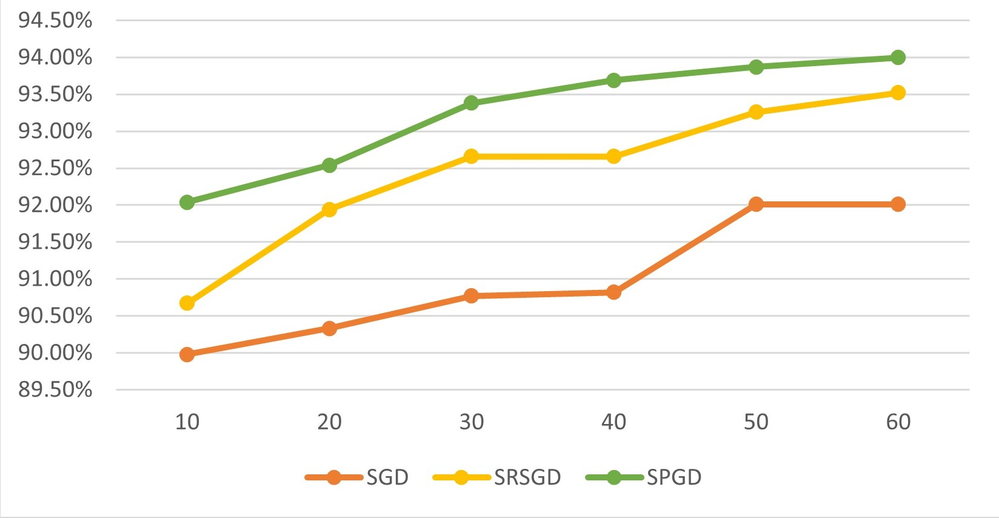

# Spawn Gradient Descent (SpGD)
<p align="justify">
<em>Official Python implementation of the manuscript "Spawning Gradient Descent (SpGD): A Novel Optimization Framework for Machine Learning and Deep Learning" by Moeinoddin Sheikhottayefe, Zahra Esmaily, and Fereshte Dehghani.</em>
</p align="justify">

   The core implementation of this project was done by [Zahra Esmaily](https://github.com/z-esmaily). We acknowledge [Abolfazl Nasr](https://github.com/abolfazlnasr) for developing the pip package.

## Contributors

- **Core Developer:** Zahra Esmaily
- **Pip Package Developer:** Abolfazl Nasr

## Table of Contents
1. [Overview](#overview)
3. [Provided Methods](#provided-methods)
4. [Evaluation in 2D Space](#evaluation-of-optimization-methods-in-2d-space)
   - [Fixed Starting Point](#fixed-starting-point)
   - [Random Starting Points](#random-starting-points)
5. [SpGD in Deep Learning Models](#spgd-in-deep-learning-models)
   - [Pip package](#pip_package)
   - [Experiments](#experiments)
6. [Ease of Use Evaluation](#ease_of_use_evaluations)

## Overview
<p align="justify">
Spawning Gradient Descent (SpGD) is a novel optimization algorithm that improves gradient-based methods by addressing common challenges such as zigzagging, suboptimal initialization, and manual learning rate tuning. SpGD introduces dynamic learning rate adjustment through Augmented Gradient Descent (AGD), controlled randomization for better exploration, and optimized movement patterns for enhanced convergence. It achieves remarkable accuracy on benchmarks, such as a near-zero error (1.7e-11) on convex functions like Quadratic, and significantly better proximity to global optima on non-convex functions like Ackley. SpGD also excels in deep learning tasks, achieving faster convergence and higher accuracy—e.g., 85% accuracy on CIFAR-10 in just 20 epochs using DenseNet-19, demonstrating its efficiency in large-scale neural network training and challenging optimization tasks.
</p>

---

## Provided Methods
The implementation includes the following optimization methods:
- Adabelief
- Adam
- Nadam
- RAdam
- Momentum
- SRSGD
- RMSprop
- GD (Gradient Descent)
- SpGD (Proposed Method)

---

## Evaluation of Optimization Methods In 2D space

### Fixed Starting Point
To evaluate the runtime and minimum distance to the answer for various methods with a fixed starting point, run the following code located in the `evaluation_2d` folder:

```bash
python Compare_SpawnGD_Fix_InitPoint.py
```

By default, a simple quadratic function is used as the test function, with the initial starting point set to `[0.0, 0.5]`. However, you can select any of the following functions:
- Naive_Quadratic (default)
- Matyas
- Rosenbrock
- Ackley
- Schaffer
- Rastrigin
- Levy

For most functions, the starting point should be selected within the range of `0.0 to 1.0` or within the defined bounds for them.

You can specify these arguments using `--function_name` and `--initial_point` as follows:

```bash
python Compare_SpawnGD_Fix_InitPoint.py --function_name <function_name> --initial_point <initial_point>
```
After running the code, the plots are automatically saved in the `plots_<function_name>` folder. </br>
If you encounter the issue: *"A module that was compiled using NumPy 1.x cannot be run in NumPy 2.0.0 as it may crash,"* use `numpy==1.26.4`.</br>
If you encounter an error during execution, especially for the Rastrigin function in the proposed method, disable the break command.

#### Plot of Points for the Quadratic Function
**Points obtained by various methods on the quadratic function with a fixed starting point of `[0.3, 0.5]` over 27 steps:**

<p align="center">
  
  
  
</p>
<p align="center">
  
  
  
</p>
<p align="center">
  
  
  
</p>

#### Plot of Points for the Ackley Function
**Points obtained by various methods on the Ackley function with a fixed starting point of `[0.3, 0.5]` over 27 steps:**

<p align="center">
  
  
  
</p>
<p align="center">
  
  
  
</p>
<p align="center">
  
  
  
</p>

---

### Random Starting Points
To evaluate the average runtime and minimum distance to the answer for various methods with random starting points over 100 iterations, run the following code located in the `evaluation_2d` folder:

```bash
python Compare_SpawnGD_Random_InitPoint.py --function_name <function_name>
```

By default, a simple quadratic function is used as the test function. However, you can change this by selecting the desired function name as follows:

```bash
python Compare_SpawnGD_Random_InitPoint.py --function_name <function_name>
```

#### Time Efficiency Evaluation
<p align="justify">
To better compare convergence speeds, we considered the time required for each optimizer to reach a specified distance (epsilon) from the optimal solution. Each optimizer was executed 100 times for each benchmark function, and the average execution time was recorded. By default, epsilon was set to 0.01 for convex functions and 0.1 for non-convex functions.
To evaluate the average runtime with consideration of an epsilon distance to the answer for various methods with random starting points over 100 iterations, run the following code located in the `evaluation_2d` folder:
</p>

```bash
python Compare_SpawnGD_Random_InitPoint_Eps_toMin.py
```

---
## SpGD in Deep Learning Models

### Pip package

The spawngd package is now available for installation via pip! You can easily install it using the following command:

#### Installation

```bash
pip install spawngd
```

#### Usage

You can use SpawnGD just like any other popular PyTorch optimizers by importing the `SpawnGD` class:

```python3
from spawngd import SpawnGD

optimizer = SpawnGD(model.parameters(), lr=1e-1, weight_decay=1e-3)
```

Note that you should pass the current epoch number to optimizer.step() method:

```python3
# optimizer.step() This method is used by most of the popular optimizers but that's not our way.

optimizer.step(epoch)
```
---
<p align="justify">
SpGD showcases its effectiveness in deep learning by addressing challenges such as slow convergence and entrapment in local minima. The proposed optimizer was integrated into <b>ResNet-20</b> and <b>DenseNet-19</b> models and evaluated on the <b>CIFAR-10</b> and <b>Fashion-MNIST</b> datasets, two widely used benchmarks in image classification, to compare its performance against other optimizers.
</p>

### Experiments
Our comparison implementation utilizes existing code from the [SRSGD](https://github.com/minhtannguyen/SRSGD) for data handling and common model architectures within PyTorch. However, it introduces a novel SpGD optimizer (defined in `spawngd.py'), located in the <code>Deep_implementation/optimizers</code>, to enhance the performance.

To evaluate the best accuracy, loss, and runtime for various optimizers on the CIFAR-10 dataset, run the `Cifar_Compare_Best_Accuracy_Time.py` file located in the `Deep_implementation` folder with the following command:

```bash
python Cifar_Compare_Best_Accuracy_Time.py --arch <model architecture> --depth <model depth> --epochs < number of epochs> --checkpoint <checkpoint path>
```

For the Fashion-MNIST dataset, use the `FashionMnist_Compare_Best_Accuracy_Time.py` file:

```bash
python FashionMnist_Compare_Best_Accuracy_Time.py --arch <model architecture> --depth <model depth> --epochs < number of epochs> --checkpoint <checkpoint path>
```
--arch: Specifies the model architecture to use (e.g., densenet or resnet).<br>
--depth: Defines the number of layers in the model (e.g., 19 for DenseNet or 20 for ResNet).<br>
--epochs: The number of training epochs to run.<br>
--checkpoint: Path where model checkpoints will be saved.

<p align="justify">
In these experiments, SpGD employs only its spawning step, excluding the adaptive learning rate mechanism for simplicity. During spawning steps, a single spawn point is generated. The experimental pattern alternates between a standard SGD step and an SGD with a spawning step.
</p>

### Findings
<p align="justify">
The spawning step improves exploration during optimization, enabling more effective exploitation in subsequent SGD steps. An alternative version of our optimizer, <b>spawngdMS</b>, introduces more frequent spawning steps relative to SGD steps. This version, along with the standard SpGD, can be found in the <code>optimizers</code> folder.
</p>

### Results
SpGD demonstrates remarkable improvements in both convergence speed and accuracy:
- **CIFAR-10**: Achieved 80% accuracy on DenseNet-19 after only 28 epochs.
- **Fashion-MNIST**: Reached 93% accuracy on ResNet-20 in just 25 epochs.

<p align="justify">
These results highlight the significant impact of the spawning step in improving exploration and efficiency during training, making SpGD a powerful alternative to traditional optimization methods for deep learning tasks.
</p>

<p align="center">
  
  
</p>

---
## Ease of Use Evaluation
For ease of use with execution commands in 2d, you can utilize the `spawngd_2d_evaluation_commands.ipynb` in `evaluation_2d` folder
For ease of use with execution commands in deep, you can utilize the `spawngd_deep_evaluation_commands.ipynb` in `Deep_implementation` folder
